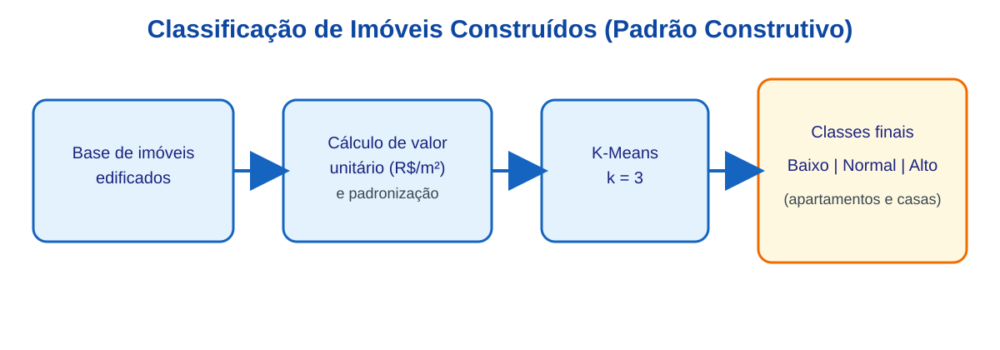
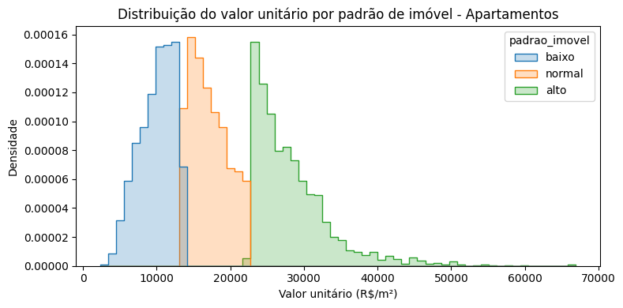
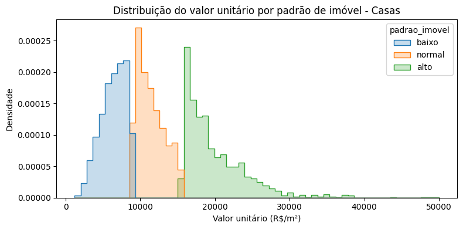
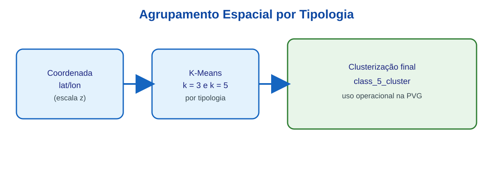
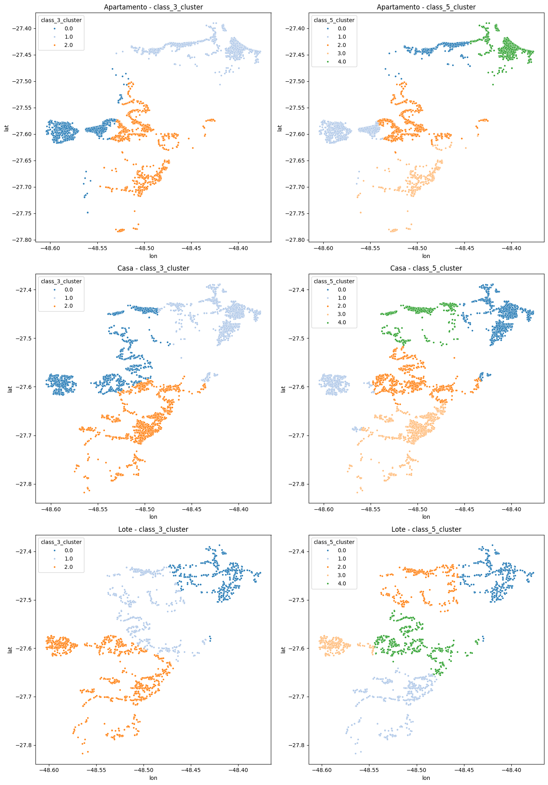

# ETAPA 3: Modelagem e Planta de Valores Genéricos (PVG) {#sec-est}

## Introdução

Este capítulo apresenta os resultados obtidos na Etapa de Modelagem e Planta de
Valores Genéricos (PVG) para a cidade de Florianópolis/SC. Na
@sec-fluxo-modelagem encontra-se o fluxo de modelagem utilizado. Todos os passos
constantes do fluxo de modelagem são descritos na sequência. Os resultados podem
ser vistos na @sec-resultados-modelagem. Nas seções -@sec-desafios-modelagem e
-@sec-escalabilidade são descritos os principais desafios encontrados e
considerações sobre a escalabilidade da solução adotada para o restante do
projeto.

## Fluxo de Modelagem {#sec-fluxo-modelagem}

O fluxo de modelagem pode ser visto na @fig-fluxo-modelagem. Basicamente, o
fluxo mostra que parte do conjunto de dados (dados de imóveis edificados) foi
utilizada para prever valores de metro quadrado construído (VUM2), gerando uma 
variável para a localização que posteriomente foi utilizada na modelagem de 
valores unitários de lotes, assim como na definição do fator de ajuste de 
mercado.

Para a estimação de valores de metro quadrado construído, foi necessária a 
classificação dos imóveis edificados (casas e apartamentos) segundo seu
padrão construtivo. Este procedimento encontra-se detalhado na @sec-classif-pc.

Além disso, os dados foram classificados segundo a sua localização geoespacial,
conforme pode ser visto na @sec-classif-geo, visando a identificação de
submercados imobiliários[^1].

[^1]: Apesar da classificação geoespacial efetuada, verificou-se que, em
Florianópolis/SC, os modelos responderam bem à subdivisão dos mercados em 
distritos, portanto esta segmentação geospacial dos mercados foi adotada. 
Optou-se por manter aqui o estudo da divisão geoespacial do mercado para fins de
eventual necessidade em outros municípios.

```{mermaid}
%%| fig-width: 4
%%| label: fig-fluxo-modelagem
%%| fig-cap: "Fluxograma da estimação do Valor de Referência."
flowchart TB
    A("RECEBIMENTO DOS DADOS DAS ETAPAS 1 E 2") --> B("LIMPEZA DOS DADOS COM REGRESSÃO ROBUSTA")
    B --> C(["CLASSIFICAÇÃO DE IMÓVEIS CONSTRUÍDOS (PADRÃO CONSTRUTIVO)"])
    B --> D(["CLASSIFICAÇÃO ESPACIAL"])
    C --> E("CONJUNTO DE DADOS DE IMÓVEIS EDIFICADOS PARA ANÁLISES")
    E --> F("MODELOS DE INTELIGÊNCIA ARTIFICIAL")
    F --VUM2 --> G("CONJUNTO DE DADOS DE LOTES PARA ANÁLISES")
    D --> G
    G --> H("MODELOS LINEARES GENERALIZADOS")
    H --Resíduos --> I("KRIGAGEM")
    I --> J("MODELO FINAL DE LOTES")
    K["CIB"] --Dados Cadastrais --> L["CÁLCULO DO CUSTO DE REEDIÇÃO"]
    J --Valores de Terrenos --> M
    L --Custo de Benfeitorias --> M["ESTIMAÇÃO DO FATOR DE AJUSTE DE MERCADO"]
    M --> N["ATRIBUIÇÃO DE VALORES DE REFERÊNCIA"]
    F --VUM2--> M
  
    style A stroke:#2962FF, fill:#2962FF,color:#FFFFFF
    style B stroke:#2962FF, fill:#FFD600,color:#FFFFFF
    style F stroke:#2962FF, fill:#FFD600,color:#FFFFFF
    style E stroke:#2962FF, fill:#2962FF,color:#FFFFFF
    style G stroke:#2962FF, fill:#2962FF,color:#FFFFFF
    style H stroke:#2962FF, fill:#FFD600,color:#FFFFFF
    style J stroke:#2962FF, fill:#FFD600,color:#FFFFFF
    style M stroke:#2962FF, fill:#FFD600,color:#FFFFFF
```


## Limpeza dos dados

Os dados oriundos do observatório do mercado imobiliário foram limpos com o 
auxílio de regressão robusta.

## Definição de variáveis

### Classificação de imóveis construídos (padrão construtivo) {#sec-classif-pc}

Para a classificação de imóveis construídos, adotou-se como variável principal o
**valor unitário** (R$/m²), calculado pela razão entre preço anunciado e área
privativa. Essa escolha foi feita por representar, de forma sintética, o
posicionamento econômico do imóvel e refletir diferenças construtivas
observáveis no mercado.

A aplicação foi realizada separadamente para os conjuntos de **apartamentos** e
**casas**, preservando a heterogeneidade entre tipologias. Em seguida, a
variável foi padronizada e submetida a agrupamento não supervisionado
(**K-Means**, com `k = 3`), com ordenação dos grupos pela média de valor
unitário e rotulagem final em três classes técnicas:

- baixo padrão;
- padrão normal;
- alto padrão.

No contexto deste relatório, o K-Means foi utilizado para organizar observações
em grupos com maior semelhança interna e maior distinção externa. O algoritmo
opera de forma iterativa, alternando duas etapas: (i) alocação de cada
observação ao centróide mais próximo; (ii) recálculo dos centróides como média
dos elementos de cada grupo. O processo é repetido até estabilização,
minimizando a soma dos quadrados das distâncias intragrupo. Como resultado,
obtém-se uma tipologia objetiva de padrão construtivo, sem impor limiares
arbitrários de preço.

{#fig-padrao-construtivo width=85%}

Os histogramas a seguir apresentam a distribuição do valor unitário (R$/m²) por
classe de padrão construtivo gerada pelo K-Means, separadamente para
apartamentos e casas. As distribuições confirmam a separação entre os grupos: em
ambas as tipologias, as curvas dos padrões baixo, normal e alto apresentam picos
em faixas distintas de valor, com sobreposição controlada nas fronteiras. Essa
separação valida que o algoritmo capturou com consistência a segmentação
econômica dos imóveis sem necessidade de limiares definidos manualmente.

Para os **apartamentos** (@fig-hist-padrao-aptos), o padrão baixo concentra-se
predominantemente na faixa de R$ 5.000 a R$ 15.000/m², o padrão normal entre R$
10.000 e R$ 20.000/m², e o padrão alto apresenta distribuição mais dispersa, com
valores a partir de R$ 20.000/m² e cauda longa até R$ 70.000/m², refletindo a
heterogeneidade do segmento de alto padrão em Florianópolis.

{#fig-hist-padrao-aptos width=90%}

Para as **casas** (@fig-hist-padrao-casas), o padrão baixo concentra-se até R$
10.000/m², o padrão normal entre R$ 8.000 e R$ 15.000/m², e o padrão alto acima
de R$ 15.000/m². Em comparação com os apartamentos, as casas apresentam faixas
de valor unitário mais comprimidas e menor dispersão no padrão alto, o que
evidencia diferenças estruturais entre as duas tipologias.

{#fig-hist-padrao-casas width=90%}

### Classificação espacial {#sec-classif-geo}

Na classificação espacial, as variáveis utilizadas foram as coordenadas
geográficas dos registros (**latitude** e **longitude**) para **cada tipologia
de imóvel**: apartamentos, casas e lotes. Utilizando as coordenadas (escala z),
foi aplicado agrupamento não supervisionado (**K-Means**) por tipologia.

Foram geradas e comparadas as classificações `class_3_cluster` e
`class_5_cluster` em cada conjunto tipológico, com inspeção visual da
distribuição espacial e da separação entre grupos. Para uso operacional no fluxo
da PVG, foi consolidada a classificação final **`class_5_cluster`**, por
apresentar melhor equilíbrio entre detalhamento territorial e estabilidade do
tamanho dos grupos.

No agrupamento espacial, o K-Means separa zonas com comportamento locacional
semelhante a partir da proximidade entre coordenadas padronizadas. Embora não
substitua uma regionalização administrativa formal, essa estratégia melhora a
representação da heterogeneidade espacial em cada tipologia e cria estratos
técnicos úteis para os modelos de valor.

{#fig-agrupamento width=85%}

{#fig-clusterizacao-tipologias width=95%}

## Critérios de validação adotados

## Construção do modelo

### Validação

## Atividades Desenvolvidas

### Seleção de variáveis

### Testes de modelos

### Calibração

## Resultados {#sec-resultados-modelagem}

### Modelo preliminar

### *Outputs* de valor

## Desafios {#sec-desafios-modelagem}

### Qualidade das variáveis

### Aderência ao mercado

## Escalabilidade {#sec-escalabilidade}

### Replicação em outros municípios
