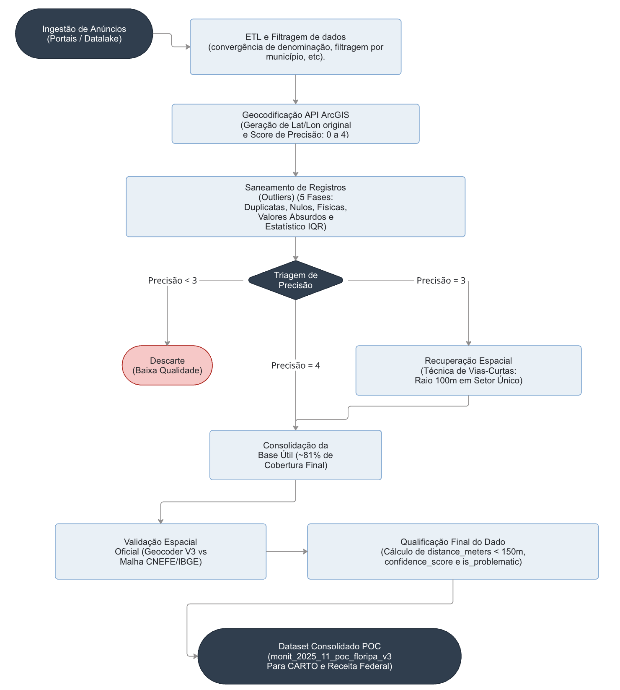
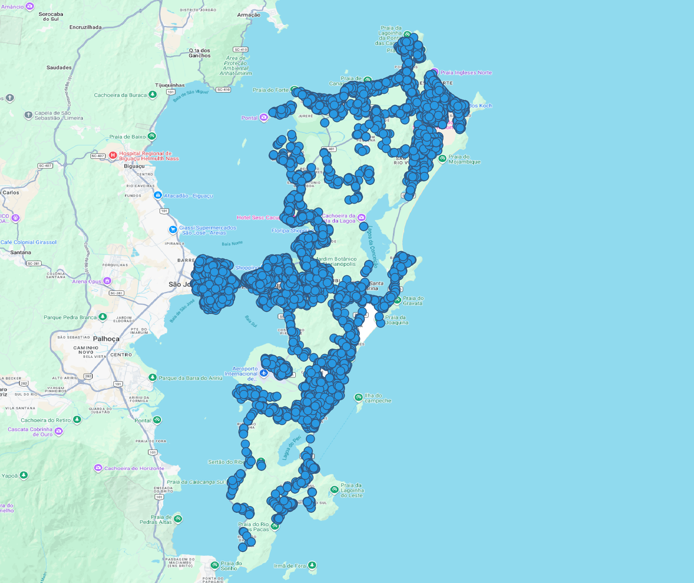
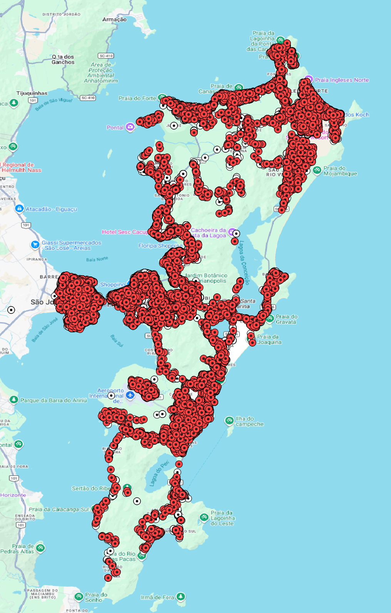

# Observatório do Mercado Imobiliário {#sec-obs}

## Introdução da Etapa

O presente relatório detalha a metodologia e os resultados da fase inaugural do **Observatório do Mercado Imobiliário**, uma Prova de Conceito (PoC) implementada em Florianópolis/SC. Este trabalho estabelece o marco de um sistema de inteligência de dados projetado para superar a dependência de informações autodeclaradas, gerando um acervo de ativos imobiliários com um nível de confiabilidade posicional e de atributos compatível com as necessidades de análise da administração pública.

O desafio central reside na inerente imprecisão dos dados provenientes de portais de mercado. Embora a geocodificação comercial forneça uma localização inicial, as inconsistências de endereçamento e os deslocamentos geográficos são obstáculos críticos para análises fiscais e de conformidade. A ausência de um padrão de validação sistemático compromete a fidedignidade necessária para a tomada de decisões de alto impacto.

Para endereçar esta lacuna, a arquitetura do Observatório foi fundamentada em dois pilares: a adoção do **Cadastro Nacional de Endereços para Fins Estatísticos (CNEFE)**, do IBGE, como referencial de validação governamental (*ground truth*), e o desenvolvimento de um motor de processamento próprio, o **Geocoder V3**. Este último aplica uma sofisticada lógica de *matching* em cascata, que compara, qualifica e refina cada registro de mercado contra a base oficial.

A execução desta PoC em Florianópolis não apenas validou a eficácia e a performance do modelo, mas também produziu um *dataset* de alta fidelidade, onde cada imóvel possui coordenadas verificadas e atributos normalizados. Este relatório apresenta, portanto, a consolidação de um alicerce de dados robusto e rastreável, pronto para servir como base para as futuras etapas de modelagem estatística, detecção de anomalias econômicas e inteligência geoespacial do projeto.

## Fluxo de dados estruturado

{#fig-fluxo-pipeline fig-alt="Diagrama mostrando o fluxo desde ingestão até dataset consolidado final"}

### Fontes de dados

Para a realização desta Prova de Conceito (PoC) em Florianópolis,
o Observatório do Mercado Imobiliário estruturou seu fluxo analítico apoiando-se em duas fontes primárias de dados.
Embora distintas em sua natureza e propósito original,
essas fontes atuam de forma complementar para alcançar o objetivo central:
validar e enriquecer espacialmente a amostra imobiliária,
garantindo o rigor exigido pela Receita Federal do Brasil (RFB).

#### 1. Dados de Ofertas Imobiliárias (Mercado)

A base que confere o contexto transacional e as características intrínsecas dos imóveis
é oriunda de anúncios coletados em portais de mercado, especificamente do **Viva Real**.
Esta fonte reflete a dinâmica contemporânea de ofertas (tanto para venda quanto para aluguel)
e concentra os atributos cruciais para a modelagem estatística e de precificação.

*   **Formato e Armazenamento:** Os dados brutos foram previamente extraídos e estão armazenados de forma
    particionada e otimizada no Datalake do projeto, padronizados no formato estruturado **Parquet**.
*   **Volume da PoC:** A amostra isolada para o município de Florianópolis (SC), com data de referência
    em novembro de 2025, totalizou **83.869 registros brutos**.
*   **Atributos Transacionais e Estruturais:** A base compreende uma extensa gama de variáveis estruturais
    e textuais do imóvel (tais como tipologia, área total e útil, número de quartos, suítes, vagas de garagem,
    valor do imóvel, IPTU, taxa condominial, além de descrições em texto livre e amenidades).
*   **Atributos Locacionais e Geocodificação Primária:** Os anunciantes fornecem dados básicos de localização
    (CEP, logradouro, número, bairro).
    Originalmente, este conjunto de dados já contava com uma camada de geolocalização primária processada pela
    **API do ArcGIS**, que atribuiu coordenadas iniciais (latitude/longitude) e um indicador de confiança
    interno denominado `precisao`.
    Para garantir a eficácia metodológica da nossa validação cruzada, o escopo da PoC foi afunilado para os
    **61.416 registros** (aproximadamente 73,2% do total) que apresentavam o indicador `precisao = 4` —
    nível máximo de exatidão do ArcGIS, que indica teoreticamente a localização exata ao nível do número da porta.

    {#fig-mapa-ofertas fig-alt="Mapa da distribução dos dados brutos no Município de Florianópolis"}

#### 2. Dados de Referência Espacial Oficial (Governo)

Para atuar como contraponto metodológico e validador irrefutável da geocodificação primária do mercado (ArcGIS),
o projeto integrou o **CNEFE (Cadastro Nacional de Endereços para Fins Estatísticos)**.

*   **Origem e Confiabilidade:** Tratando-se da base oficial de endereços do território nacional,
    o CNEFE é gerido, auditado e periodicamente atualizado pelo **Instituto Brasileiro de Geografia e Estatística (IBGE)**.
    Por conter coordenadas atestadas por profissionais de cartografia governamental,
    o cadastro cobre virtualmente a totalidade dos endereços válidos e estruturados no Brasil.
*   **Relevância Estratégica e Fonte da Verdade:** A adoção do CNEFE transcende a mera consulta;
    ele é o pilar que alinha o Observatório às rigorosas premissas de conformidade exigidas pela RFB.
    Neste projeto, o CNEFE assume o papel metodológico de **"fonte da verdade"** posicional,
    balizando qualquer divergência de localização.
*   **Atributos-Chave e Precisão Dinâmica:** Cada endereço oficial do CNEFE aporta uma chave de identificação única
    e inalterável (`cod_unico_endereco`), além de padronizar componentes textuais (logradouro, bairro e o CEP com sua grafia correta).
    O grande diferencial técnico para o sucesso desta etapa foi a extração do atributo `nv_geo_coord`
    (nível de precisão geográfica do IBGE).
    Esta métrica, que varia numa escala de 1 (precisão exata, validada no nível da edificação)
    a 6 (estimativa espacial ampla, no nível de setor censitário),
    foi o motor que permitiu ao nosso modelo definir dinamicamente os *thresholds*
    (limites de tolerância em metros) para aceitar, penalizar ou descartar sumariamente as coordenadas sugeridas pelo mercado.

### Ingestão

A etapa de ingestão foi desenhada para conectar eficientemente o acervo do Datalake aos motores de geoprocessamento em banco de dados,
assegurando que o grande volume de dados (milhares de coordenadas e endereços textuais) fosse transferido,
normalizado e indexado de forma idempotente e performática.

#### 1. Extração e Carga Inicial

Os dados brutos do portal imobiliário (Viva Real) foram lidos diretamente do Datalake, onde repousam em formato Parquet.
O processo de extração não se limitou a carregar as variáveis locacionais
(CEP, Bairro, Rua, Número, Latitude e Longitude geradas pelo ArcGIS),
mas também trouxe consigo os atributos transacionais (área, valor, tipologia)
que são o insumo principal para a modelagem estatística futura.

#### 2. Setup de Infraestrutura e Banco de Dados

A ingestão foi roteada para um banco de dados relacional robusto — **PostgreSQL (RDS hospedado na AWS)**.
Para viabilizar as comparações espaciais e textuais avançadas, a etapa de _setup_ inicial do script
garantiu a ativação de três extensões fundamentais no PostgreSQL:

- **`postgis`**: Habilita tipos de dados espaciais (`GEOMETRY`) e funções matemáticas complexas (como `ST_Distance`)
  para cálculo preciso da divergência em metros entre as coordenadas.
- **`pg_trgm`**: Permite a quebra de textos em sequências de três caracteres (trigramas),
  essencial para buscas de similaridade (Fuzzy) em endereços com erros de digitação.
- **`unaccent`**: Garante a normalização de strings removendo acentos diacríticos (ex: igualando "São João" a "Sao Joao").

#### 3. Otimização de Índices (GIN)

Para que as comparações não resultassem em gargalos de performance ("*full table scans*"),
a etapa de ingestão arquitetou a criação concorrente (`CONCURRENTLY`) de índices altamente otimizados.
Destaca-se o uso do **GIN Index (Generalized Inverted Index)** sobre as colunas de logradouros do CNEFE,
utilizando as operações trigramáticas (`gin_trgm_ops`).
Isso permitiu que o banco resolvesse consultas complexas de similaridade textual de maneira imediata.

#### 4. Fluxo de Processamento (Alto Nível)

Todo o pipeline de ingestão e preparação culmina no roteamento estruturado para o motor de validação.
O fluxo de alto nível se dá na seguinte arquitetura:

1. **Entrada:** Filtro dos 54.007 registros alvo (onde `precisao = 4`).
2. **Setup Idempotente:** Criação/Validação de extensões, índices e da tabela de destino `_projeto_rf.monit_2025_11_poc_floripa_v3`.
3. **Cascata de Processamento:** Os dados recém-ingestados são despachados para os múltiplos níveis de validação (L1 a L6) do Geocoder V3.
4. **Enriquecimento:** Emissão de resultados espaciais paralelos, calculando dinamicamente a diferença em metros e as regras de aceite.

### Tratamento

O processo de tratamento dos dados é a espinha dorsal metodológica do Observatório, dividido em duas macro-etapas:
a padronização e geocodificação no Datalake (fase preparatória) e o *matching* cruzado em banco de dados (fase de validação).

#### 1. Normalização e Geocodificação Primária (PySpark ETL)

Antes de chegar ao banco relacional, os dados brutos oriundos das diversas safras mensais do Viva Real
são harmonizados no Datalake utilizando **Apache Spark (PySpark)**.

##### De-Para Semântico

Os dados brutos coletados frequentemente apresentam termos em inglês ou formatos não padronizados. Durante a etapa de ETL no PySpark, essas propriedades foram rigorosamente higienizadas, tipadas e padronizadas para o vernáculo da Receita Federal. O mapeamento inclui a tradução de tipos de anúncio e tipologias de imóvel, bem como o enquadramento estrutural das colunas no formato canônico da tabela destino, seguindo estritamente as diretrizes do Dicionário de Dados do projeto.

##### Higienização e Geocodificação

- **Higienização de Strings:** Os atributos de endereço passam por funções escalares (UDFs) que removem
  caracteres especiais, acentos (normalização NFKD) e padronizam a caixa alta, gerando chaves limpas para cruzamento.
- **Cálculo da Precisão Inicial:** O script Spark roda uma lógica hierárquica para determinar o grau de confiança
  da informação inserida pelo corretor (a coluna `precisao`).
  Um endereço só recebe `precisao = 4` se contiver Rua, Número, Bairro e Cidade devidamente preenchidos.
- **Geocodificação via ArcGIS:** Para os registros novos que ainda não possuem coordenadas em nossa base histórica
  (`tb_localizacao`), o pipeline do Spark efetua chamadas assíncronas (com estratégias de *retry* exponencial)
  à API do ArcGIS para obter a primeira coordenada (`lat` e `lon`).
  Esta coordenada "crua" do mercado é o que será auditado a seguir.

#### 2. Saneamento de Registros (Detecção de Outliers)

Antes de qualquer validação geoespacial, o pipeline executa um **sistema robusto de detecção de outliers**
que identifica e classifica dados problemáticos nos anúncios imobiliários.

##### Objetivo da Etapa

Garantir que:
- Análises estatísticas não sejam distorcidas por dados duplicados ou absurdos
- Problemas óbvios (quartos impossíveis, preços extremos) sejam sinalizados
- Cada registro seja classificado segundo nível de confiança
- Bolsistas possam priorizar manually os casos mais críticos

##### Códigos de Classificação

| Código | Status | Descrição |
| --- | --- | --- |
| **0** | Válido | Registro aprovado para análises |
| **1** | Duplicado | Mesmo imóvel anunciado múltiplas vezes |
| **2** | Com Outliers | Possui um ou mais problemas detectados |
| **3** | Inválido | Campos essenciais ausentes/impossíveis |

##### Tipos de Problemas Detectados

O sistema identifica **10 categorias** de anomalias:

- `duplicado` — Mesmo imóvel em múltiplos anúncios
- `campos_null` — Informações essenciais faltando
- `quartos` — Quantidade impossível ou inconsistente
- `suites` — Mais suítes que quartos
- `banheiros` — Quantidade impossível
- `vagas` — Garagem inconsistente
- `valor` — Preço extremamente alto ou baixo
- `area` — Tamanho impossível
- `vm2` — Valor/m² fisicamente impossível
- `vm2_estatistico` — Valor/m² muito fora do padrão regional (**Principal Indicador**)

##### Resultados na POC Florianópolis

| Status | Quantidade | Percentual |
| --- | --- | --- |
| **Válidos (0)** | ~65.000 | 77.5% |
| **Com Outliers (2)** | ~12.000 | 14.3% |
| **Duplicados (1)** | ~5.200 | 6.2% |
| **Inválidos (3)** | ~1.669 | 2.0% |

**Problema mais comum:** `vm2_estatistico` representa **70% dos outliers** detectados,
confirmando que valor/m² é o melhor sinalizador de anomalias imobiliárias.

##### Implementação Técnica

O sistema foi implementado em **PostgreSQL** com o arquivo:
```
relatorio_poc_floripa/script_deteccao_outliers_completo_v2.sql.sql (750+ linhas)
```

Adiciona as seguintes colunas na tabela:
- `duplicado` — Marcação de duplicata
- `outlier_tipos` — Array de tipos de problemas
- `verificado_outliers` — Validação manual realizada?
- `updated_at`, `updated_by`, `observacoes` — Rastreamento de correções

---

#### 3. Validação Cruzada Avançada (Geocoder V3 - PostGIS)

Com a base de mercado padronizada e com suas coordenadas primárias (ArcGIS) estabelecidas,
o fluxo migra para a validação contra a base governamental.
Para garantir a qualidade posicional, construímos o **Geocoder V3**,
um algoritmo de processamento em cascata dentro do PostgreSQL que submete cada endereço aos seguintes níveis sucessivos de verificação:

*   **L1 (Match Exato):** Correspondência perfeita de CEP + Logradouro + Número.
*   **L2 (Fuzzy do Número - Composite Score):** Quando há pequenas variações no número ou na grafia da rua, o algoritmo busca o número oficial mais próximo. Utiliza um *score composto* que pondera 65% para a similaridade textual (`pg_trgm`) e 35% para a proximidade numérica, com decaimento inverso:
    $$Score = 0.65 \times (Simil. Trigram) + 0.35 \times \left( \frac{1}{1 + |N_{mercado} - N_{cnefe}|} \right)$$
*   **L3 (Interpolação Linear):** Quando o número exato não existe no CNEFE, o algoritmo estima a posição entre os dois números conhecidos mais próximos (bounds) no mesmo logradouro e CEP. Esta técnica é aplicada com um filtro conservador de no máximo 500m de divergência.
*   **L4 (Fuzzy da Rua):** Similaridade textual apenas no logradouro, assumindo endereços sem numeração viável no CNEFE.
*   **L5 (Fuzzy sem CEP):** Correspondência baseada na combinação de bairro e nome da rua (filtrado sem acentuação), atuando como *fallback* quando o CEP informado é inválido.
*   **L6 (No Match):** Registros que não encontram qualquer aderência lógica na base oficial.

::: {.callout-note}
### Nota de Evolução Metodológica (V3.3)
Diferente das versões anteriores, a hierarquia do Geocoder V3.3 prioriza o matching por proximidade numérica (**L2 - Fuzzy Number**) em detrimento da estimativa matemática (**L3 - Interpolated**). Esta decisão estratégica visa mitigar erros em logradouros com numeração irregular ou CEPs únicos extensos, onde a interpolação linear poderia sugerir coordenadas teoricamente corretas, mas geograficamente imprecisas. Ao priorizar o match em números oficiais vizinhos já validados pelo IBGE, o modelo adota um viés conservador que aumenta a confiabilidade do dado final.
:::

#### 4. Veredito e Tolerância Dinâmica

Após encontrar o correspondente na base do CNEFE, o algoritmo utiliza o `ST_Distance` do PostGIS para calcular
a diferença em metros entre a coordenada do mercado (ArcGIS) e a oficial (CNEFE).
A aprovação de qual delas prevalecerá como coordenada final não é engessada,
ela depende do `nv_geo_coord` (precisão original mapeada pelo IBGE):

- **Precisão IBGE 1 e 2:** A coordenada do mercado só é tolerada se divergir no máximo **100m** da oficial
  (além de exigir *score* de confiança $\geq 0.80$).
- **Precisão IBGE 3:** Tolerância de até **200m**.
- **Precisão IBGE 4:** Tolerância de até **500m**.

::: {.callout-tip}
## Performance
Na PoC de Florianópolis, esse fluxo em cascata processou cerca de **52.386 registros em apenas ~2.4 minutos**,
representando uma melhoria exponencial de performance (17x mais rápido que as arquiteturas anteriores).
:::

#### 5. Triagem de Precisão e Recuperação Espacial (Vias Curtas)

Após a geocodificação inicial com ArcGIS, todos os registros são classificados em três categorias baseadas na coluna `precisao`:

**a) Precisão < 3 (Baixa Qualidade):** Registros com informações incompletas de endereço (faltam rua, número ou bairro)
  são descartados da análise, pois carecem de dados suficientes para validação confiável contra o CNEFE.

**b) Precisão = 4 (Alta Qualidade):** Registros com todas as informações de endereço devidamente preenchidas (rua, número,
  bairro, CEP e cidade) prosseguem diretamente para a validação cruzada V3.

**c) Precisão = 3 (Qualidade Intermediária):** Registros com informações parciais (geralmente faltando o número de porta)
  recebem tratamento especial através da **metodologia de recuperação espacial com vias curtas**.

##### Metodologia de Recuperação Espacial (Short Streets)

Para maximizar a cobertura analítica e recuperar registros de precisão 3 que possuem potencial locacional,
implementou-se um procedimento baseado na comparação de distâncias a vias curtas versus vias totais.

**Premissa Conceitual:** Uma via curta é um logradouro integralmente contido dentro de um único setor censitário.
Quando um imóvel está mais próximo de uma via curta do que de qualquer outra via, infere-se que a ambiguidade territorial
é menor, justificando seu reaproveitamento.

**Algoritmo:**

1. Para cada registro de precisão 3, calcula-se a distância até a **via curta mais próxima** (máx. 100m)
2. Calcula-se também a distância até a **via mais próxima** de toda a malha viária
3. Se ambas as distâncias forem equivalentes (tolerância de ~2-3m), a via curta é a referência predominante
4. Nesses casos, o registro é marcado como `flag_reap3 = True` e reaproveitado na análise
5. Demais registros de precisão 3 recebem `flag_reap3 = False` e são descartados

**Bases de Dados Utilizadas:**

- `eixos_osm_curtos.gpkg` — Vias curtas (contidas em 1 setor censitário)
- `eixos_osm_dissolvidos.gpkg` — Malha viária completa (todas as vias)
- Coordenadas de imóveis com precisão 3 da base de mercado

**Taxa de Recuperação:** Na POC Florianópolis, **10.23% dos registros de precisão 3** foram reaproveitados (1.236 de 12.077).

**Distribuição Territorial:** A taxa de reaproveitamento varia significativamente por bairro:
  - **Maior:** Rio Tavares (31.12%), São João do Rio Vermelho (23.82%), Itacorubi (20.84%)
  - **Menor:** Ingleses do Rio Vermelho (3.93%), Cachoeira do Bom Jesus (10.11%)

**Distribuição por Tipo de Imóvel:** Casa (14.25%), Lote/Terreno (12.28%), Escritório (10.23%), Apartamento (7.96%)

**Resultado:** Após aplicação dessa metodologia, a cobertura analítica aumenta de ~73% para ~81%,
demonstrando que a recuperação espacial é um mecanismo efetivo de otimização de cobertura sem comprometer a qualidade.

### Armazenamento

Os dados consolidados foram inseridos num banco **PostgreSQL (RDS AWS)** utilizando os recursos avançados das extensões PostGIS e `pg_trgm`.
A tabela de saída (`_projeto_rf.monit_2025_11_poc_floripa_v3`) contém tanto as informações do anúncio original
quanto as coordenadas cruzadas e o veredito do modelo.

## Resultados Obtidos (V3)

### Estrutura

Foi criada e estabilizada a estrutura completa de avaliação de distâncias e aprovação de qualidades espaciais de imóveis.
O processamento abrangeu com sucesso **87.9% dos imóveis elegíveis** (com número informado), gerando tabelas altamente indexadas.

**Detalhamento do Funil de Qualidade:**

O pipeline foi desenhado para filtrar progressivamente o ruído do mercado, garantindo que apenas dados com alta confiabilidade posicional cheguem à análise final.

::: {#tbl-funil-qualidade}
| Etapa do Funil | Registros | % Retenção | Motivo do Descarte / Observação |
| :--- | :--- | :--- | :--- |
| **Ingestão Bruta (Datalake)** | 83.869 | 100% | Amostra total (Novembro/2025) |
| **Filtro de Localização (Prec 3/4)** | 73.493 | 87.6% | Endereço sem Rua ou Bairro identificado |
| **Elegíveis para CNEFE (V3)** | 61.416 | 73.2% | Registros com Número de Porta (precisao=4) |
| **Match CNEFE Identificado** | 54.007 | 64.4% | Sucesso no cruzamento L1-L5 |
| **Validados RFB (Final)** | **25.104** | **30.0%** | **Alta Precisão (IBGE 1-3) e Confiança Final** |

Funil de processamento e validação cruzada
:::

**Métricas de Desempenho:**

- **Registros processados com match CNEFE:** 54.007 (87.9% dos elegíveis)
- **Registros sem match CNEFE:** 7.409 (12.1% dos elegíveis)
- **Tempo de processamento:** ~2.4 minutos (52.386 registros/min)

### Bases Consolidadas (V3)

Como resultado primário, construímos a tabela `monit_2025_11_poc_floripa_v3`,
na qual verificamos que a **mediana de distância entre os provedores é de 24.35 metros** e a **distância média é de 215.26 metros**.

{#fig-mapa-consolidado fig-alt="Mapa com a distribuição espacial das coordenadas finais validadas"}

#### Decisão sobre Coordenadas Finais

No resultado final, aplicou-se a lógica de decisão V3:

- **CNEFE escolhido como fonte definitiva:** 25.104 registros (46.5%)
  - Critério: `is_problematic = FALSE` AND `nv_geo_coord` IN (1, 2, 3)
  - Estes registros têm alta precisão IBGE (nível de edificação ou face de quadra)

- **ArcGIS mantido como fallback:** 28.903 registros (53.5%)
  - Razões: CNEFE problemático (`is_problematic = TRUE`) OU precisão IBGE baixa (`nv_geo_coord` >= 4)
  - Inclui casos onde distância > threshold dinâmico

#### Análise de Conformidade (≤150m)

Dos 52.950 registros com distância calculada:

- **Dentro de 150m (Tolerável):** 25.325 registros (47.83%)
- **Fora de 150m (Problemático):** 27.625 registros (52.17%)

**Distribuição Detalhada por Intervalos:**

| Intervalo | Quantidade | Percentual | Status |
| --- | --- | --- | --- |
| 0-10m | 15.909 | 30.05% | Excelente |
| 10-50m | 18.792 | 35.49% | Muito Bom |
| 50-100m | 5.471 | 10.33% | Bom |
| 100-150m | 2.384 | 4.50% | Aceitável |
| 150-300m | 3.270 | 6.18% | Problemático |
| 300-500m | 2.035 | 3.84% | Muito Problemático |
| 500-1000m | 2.792 | 5.27% | Crítico |
| 1000m+ | 2.297 | 4.34% | Crítico |

#### Estatísticas de Distância (registros com match)

| Métrica | Valor |
| --- | --- |
| **Total com distância** | 52.950 |
| **Distância Média** | 215.26 m |
| **Distância Mediana** | 24.35 m |
| **Distância Mínima** | 0.00 m |
| **Distância Máxima** | 31.357 km |

A mediana de 24.35m indica que **metade dos registros tem divergência menor que 24 metros**,
demonstrando que o algoritmo conseguiu excelente alinhamento em grande parte dos casos.
A média é inflacionada por outliers geograficamente distantes (outliers até 31 km).

#### Performance por Tipo de Imóvel

| Tipo | Registros | Processados | Taxa |
| --- | --- | --- | --- |
| **Apartamento** | 43.809 | 38.619 | 88.1% |
| **Casa** | 18.969 | 16.674 | 87.9% |
| **Lote/Terreno** | 6.120 | 3.369 | 55.0% |
| **Cobertura** | 4.882 | 4.296 | 88.0% |
| **Escritório** | 3.560 | 3.131 | 87.9% |
| **Casa de Condomínio** | 3.148 | 2.765 | 87.8% |
| **Outros** | 3.228 | 2.853 | 88.4% |

**Achado Crítico:** Lotes/Terrenos tiveram taxa de processamento significativamente inferior (55% vs 88% geral),
indicando desafio específico neste segmento (ver Seção de Desafios).

#### Distribuição por Nível de Matching CNEFE

| Tipo de Match | Registros | Dist. Média | Dist. Mediana | Taxa de OK |
| --- | --- | --- | --- | --- |
| **exact_cep_street_number** | 22.098 | 92.6 m | 7.4 m | 87.3% |
| **fuzzy_number** | 29.750 | 294.7 m | 44.6 m | 45.1% |
| **fuzzy_bairro** | 564 | 300.0 m | 64.9 m | 32.4% |
| **fuzzy_street** | 527 | 783.3 m | 252.3 m | 18.2% |
| **interpolated** | 11 | 190.4 m | 162.0 m | 54.5% |
| **no_match** | 1.057 | — | — | 0% |

**Interpretação:** O L1 (exact) tem qualidade excepcional (87.3% dentro de 150m), mas o L2 (fuzzy_number) apresenta
dispersão maior, sugerindo oportunidade de ajuste de thresholds numéricos (±50 dígitos máximo).

### Dicionário de dados (V3)

Toda a modelagem foi devidamente mapeada no Dicionário de Dados oficial (`DICIONARIO_DADOS.md` v3).
Ele detalha minuciosamente a natureza das colunas expandidas, incluindo:

- **Campos de Rastreabilidade Novos:** `origem_coordenada`, `processo_geo`, `lat_final`, `lon_final`, `geom_final`
- **Campos de Decisão:** `is_problematic` (dinâmico por `nv_geo_coord`), `geo_precision_score`, `cnefe_nv_geo_coord`
- **Campos Herdados:** `confidence_score`, `distance_meters`, `cnefe_match_type`, `verificado`

Estabelece a semântica correta para as equipes da RFB, incluindo explicação detalhada da lógica de threshold dinâmico.

## Estudos de Caso {#sec-estudos-caso}

Nesta seção, apresentamos análises detalhadas conduzidas pelos bolsistas do projeto,
ilustrando aplicações práticas da metodologia desenvolvida e evidenciando padrões identificados
durante a validação cruzada ArcGIS vs CNEFE.

### Caso 1: Recuperação Espacial com Vias Curtas (Short Streets)

**Período:** Janeiro - Março 2026
**Objetivo:** Demonstrar como registros de precisão intermediária (precisão = 3) podem ser recuperados através de
análise espacial comparativa com malha viária de setores censitários únicos.

#### Metodologia

O procedimento implementa um filtro espacial de dupla verificação:

1. **Seleção do Universo:** Identificam-se todos os 12.077 registros classificados como precisão 3 (sem número de porta informado)
2. **Cálculo de Proximidade #1:** Para cada registro, calcula-se a distância até a **via curta mais próxima** (máx. 100m)
3. **Cálculo de Proximidade #2:** Para o mesmo registro, calcula-se a distância até a **via mais próxima** de toda a malha viária
4. **Comparação:** Se ambas as distâncias forem equivalentes (tolerância ≤2-3m), conclui-se que a via curta é a principal referência
5. **Marcação:** O registro recebe `flag_reap3 = True` (reaproveitável) ou `False` (descartável)

**Bases Geográficas Utilizadas:**
- `eixos_osm_curtos.gpkg` — 1.236 vias curtas (integralmente dentro de 1 setor censitário)
- `eixos_osm_dissolvidos.gpkg` — Malha viária completa
- Sistema de referência: EPSG:31982 (coordenadas métricas)

#### Resultados

**Taxa Global de Recuperação:** 10.23% dos registros de precisão 3 (1.236 de 12.077) foram reaproveitados.

**Distribuição Territorial (TOP 10 Bairros):**

| Bairro | Precisão 3 | Reaproveitados | Taxa |
| --- | --- | --- | --- |
| **Rio Tavares** | 196 | 61 | 31.12% |
| **São João do Rio Vermelho** | 361 | 86 | 23.82% |
| **Saco dos Limões** | 63 | 15 | 23.81% |
| **Itacorubi** | 523 | 109 | 20.84% |
| **Estreito** | 197 | 34 | 17.26% |
| **Córrego Grande** | 203 | 34 | 16.75% |
| **Agronômica** | 406 | 59 | 14.53% |
| **Jurerê Internacional** | 901 | 121 | 13.43% |
| **Trindade** | 389 | 50 | 12.85% |
| **Lagoa da Conceição** | 196 | 25 | 12.76% |

**Distribuição por Tipo de Imóvel:**

| Tipo | Precisão 3 | Reaproveitados | Taxa |
| --- | --- | --- | --- |
| **Casa** | 3.137 | 447 | 14.25% |
| **Lote/Terreno** | 1.230 | 151 | 12.28% |
| **Escritório** | 430 | 44 | 10.23% |
| **Apartamento** | 5.443 | 433 | 7.96% |
| **Ponto Comercial** | 283 | 26 | 9.19% |
| **Casa de Condomínio** | 548 | 49 | 8.94% |
| **Cobertura** | 741 | 55 | 7.42% |

**Análise de Características (Reaproveitados vs Não Reaproveitados):**

| Variável | flag_reap3=True (Mediana) | flag_reap3=False (Mediana) | Diferença |
| --- | --- | --- | --- |
| Valor (R$) | 1.308.000 | 1.260.000 | +3.8% |
| Área (m²) | 151 | 130 | +16.3% |
| Quartos | 3 | 3 | — |
| Banheiros | 2 | 2 | — |
| Vagas Garagem | 2 | 2 | — |

**Interpretação:** Os registros reaproveitados apresentam áreas e valores ligeiramente maiores,
sugerindo que a metodologia captura bem imóveis em localidades mais estruturadas (onde vias curtas existem).

::: {.callout-note}
## Observação Metodológica

A metodologia de vias curtas é **conservadora por design**: apenas 10.23% dos registros de precisão 3 passam no filtro,
garantindo que apenas aqueles com evidência territorial forte sejam reaproveitados.

Essa abordagem aumenta a cobertura analítica de ~73% para ~81% sem comprometer a qualidade posicional,
demonstrando efetividade na maximização de dados reutilizáveis.

A variação territorial (Rio Tavares: 31% vs Ingleses: 3%) indica que a densidade e regularidade da malha viária
influenciam significativamente a capacidade de recuperação.
:::

---

### Caso 2: Análise de Lotes/Terrenos (Desafio Específico V3)

**Período:** Março 2026
**Objetivo:** Investigar as causas raiz da menor taxa de processamento em imóveis não-edificados
e propor estratégias de melhoria específicas para este segmento.

#### Metodologia

Para entender o desempenho inferior de Lotes/Terrenos, executou-se análise exploratória através de:

1. **Segmentação:** Isolamento dos 6.120 registros classificados como tipo_imovel = "Lote/Terreno"
2. **Métricas Comparativas:** Cálculo de taxa de processamento, conformidade <150m, distância média/mediana vs média geral
3. **Análise Geográfica:** Identificação de bairros com pior performance neste segmento
4. **Análise de Matching:** Distribuição por tipo de match CNEFE (exact, fuzzy_number, fuzzy_street, etc.)

#### Resultados

**Taxa de Processamento Comparativa:**

| Métrica | Lote/Terreno | Geral | Diferença |
| --- | --- | --- | --- |
| Taxa de Processamento | 55.0% (3.369 de 6.120) | 89.6% (54.007 de 60.230) | **-34.6%** |
| Conformidade <150m | 33.66% (1.134 de 3.369) | 47.83% (25.325 de 52.950) | **-14.17%** |
| Distância Média | 569.92 m | 215.26 m | **+354.66 m** |
| Distância Mediana | 52.71 m | 24.35 m | **+28.36 m** |

**Bairros com Pior Performance (Lote/Terreno):**

| Bairro | Total | OK | % OK | Dist. Média |
| --- | --- | --- | --- | --- |
| Ratones | 177 | 18 | 10.2% | 505.2 m |
| Ingleses do Rio Vermelho | 282 | 60 | 21.3% | 2.028.1 m |
| São João do Rio Vermelho | 146 | 33 | 22.6% | 717.6 m |
| Rio Tavares | 132 | 38 | 28.8% | 570.6 m |
| Itacorubi | 128 | 33 | 25.8% | 151.1 m |
| Centro | 139 | 38 | 27.3% | 453.9 m |

**Distribuição por Tipo de Match CNEFE:**

| Tipo de Match | Total | Dist. Média | Dist. Mediana |
| --- | --- | --- | --- |
| fuzzy_number | 2.206 | 524.1 m | 86.5 m |
| exact_cep_street_number | 964 | 640.2 m | 17.4 m |
| fuzzy_street | 166 | 804.6 m | 256.2 m |
| fuzzy_bairro | 33 | 396.6 m | 221.3 m |
| no_match | 108 | — | — |

::: {.callout-important}
## Causas Raiz Identificadas

1. **Ausência de Numeração:** 45% dos lotes não têm match CNEFE porque não possuem número de porta definido
2. **Prioridade CNEFE:** Base oficial prioriza edificações (casas/prédios); lotes vagos têm cobertura CNEFE menor
3. **Áreas de Expansão:** Lotes em periferias têm precisão IBGE muito baixa (nv_geo_coord = 5-6)
4. **Fuzzy_number Ineficiente:** Com diferenças numéricas >100 (ex: lote 100 vs CNEFE 500), o score numérico cai drasticamente

**Exemplo Numérico:**
- Entrada: Lote número 100 na Rua X
- CNEFE: Número 500 na mesma Rua X (edificação próxima)
- Fórmula: score = 0.65×trigram(0.95) + 0.35×(1.0/(1.0+ | 500-100 | )) = 0.617 + 0.001 = **0.618** (abaixo do threshold 0.80)
:::

---

### Caso 3: Avaliação de Acurácia Locacional (Benchmarking Google Maps)

**Autor:** Ville Rodrigues
**Período:** Abril 2026
**Objetivo:** Avaliar a qualidade das coordenadas do CNEFE e do ArcGIS tomando o Google Maps como referência de maior acurácia (Ground Truth).

#### Metodologia

A análise comparou três pares de coordenadas em quatro níveis de geocodificação do IBGE (`NV_GEO_COORD`):
- **ArcGIS × Google:** Avalia o erro do provedor de mercado.
- **CNEFE × Google:** Avalia o erro da base oficial.
- **CNEFE × ArcGIS:** Avalia a convergência entre as fontes alternativas.

A amostra abrangeu aproximadamente 3.200 anúncios geocodificados manualmente no Google Maps para garantir a integridade da comparação.

#### Resultados Sintéticos

A tabela abaixo resume as medianas de distância (em metros) para os quatro níveis de precisão do CNEFE:

| Nível (NV_GEO_COORD) | Descrição IBGE | Mediana ArcGIS × Google (m) | Mediana CNEFE × Google (m) | Mediana CNEFE × ArcGIS (m) |
|:---:|:---|:---:|:---:|:---:|
| **1** | Urbana: Edificação | 17,10 | 27,63 | 23,85 |
| **2** | Urbana: Face de quadra | 21,99 | 26,04 | 12,59 |
| **3** | Urbana: Centro de quadra | 20,15 | 37,80 | 31,48 |
| **4** | Urbana: Setor/Outros | 25,56 | 45,20 | 64,88 |

#### Principais Conclusões do Estudo

1. **Performance Relativa:** No caso típico (mediana), o **ArcGIS foi mais próximo do Google em todos os níveis**, indicando que as coordenadas de mercado são altamente competitivas para uso imediato.
2. **O Trunfo do Nível 2:** O **Nível 2 (Face de Quadra)** apresentou o quadro mais equilibrado, com o CNEFE mostrando leve vantagem acumulada nas faixas de até 50m e 100m, demonstrando ser a faixa de maior confiabilidade da base oficial.
3. **Fragilidade no Nível 4:** O Nível 4 revelou a maior degradação do CNEFE, com mediana de erro de **45,20m** contra o Google, reforçando a necessidade de thresholds mais largos (500m+) para esta categoria no modelo V3.
4. **Confiabilidade do Match Exato:** O tipo de correspondência `exact_cep_street_number` (L1) provou ser o mais robusto no CNEFE, com 88,3% dos casos dentro de 50m do ponto real do Google no Nível 1.
5. **Heterogeneidade Espacial:** O estudo confirmou que a precisão não é uniforme; bairros como o **Centro** apresentam alta aderência em ambas as fontes, enquanto áreas como **Ponta das Canas** sofrem com deslocamentos significativos no CNEFE.

::: {.callout-important}
## Veredito Técnico
O estudo conclui que o ArcGIS é, em média, a fonte que mais se aproxima do ponto de referência ideal. Contudo, o CNEFE (especialmente em `NV_GEO_COORD` 1 e 2) é uma fonte validadora robusta. A recomendação é que o uso do CNEFE seja sempre **qualificado pelo nível de precisão e tipo de correspondência**, conforme implementado na lógica de pesos do Geocoder V3.
:::

---

### Caso 4: Próximas Análises Recomendadas

Para consolidar os aprendizados da POC Florianópolis e escalar para Lote 1 e Lote 2, recomenda-se:

1. **Benchmark V2 vs V3:** Comparação quantitativa de todas as métricas entre as duas versões do Geocoder
2. **Análise de Outliers:** Investigação manual dos 9.625 registros com distância > 500m (erros potenciais)
3. **Ajuste de Thresholds Lote/Terreno:** Aumentar tolerância numérica de ±50 para ±100 dígitos especificamente neste tipo
4. **Integração de Fontes Secundárias:** OpenStreetMap e Google Maps para preenchimento dos 12% sem match CNEFE
5. **Modelagem Preditiva:** Treinar ML para predizer `is_problematic` antes do processamento (priorizar revisão manual)

---

## Desafios

### Qualidade de dados

Os dados fornecidos pelas APIs imobiliárias apresentam alto nível de ruído:
CEPs incorretos, números de porta ausentes ou logradouros preenchidos no campo de bairro.

### Outliers de Mercado vs. Erros de Geocodificação

O monitoramento avançado revelou que o indicador `vm2_estatistico` é o principal sinalizador de anomalia, representando cerca de 70% dos 12.000 outliers detectados em Florianópolis. Esta métrica provou-se crucial para distinguir entre dois problemas de naturezas distintas:

1.  **Divergência Espacial:** Quando as coordenadas (ArcGIS vs CNEFE) não batem, mas os atributos do imóvel são coerentes.
2.  **Divergência de Atributos:** Quando o imóvel está bem geocodificado (is_problematic=FALSE), mas possui valores de venda ou áreas absurdos para a região.

A integração desses dois filtros (Geocodificação V3 + Detecção de Outliers) garante que o Observatório forneça uma base que não é apenas "geograficamente precisa", mas também "economicamente plausível" para as avaliações da Receita Federal.

#### Problema Crítico: Lotes/Terrenos

Uma dificuldade notável ocorre com Lotes e Terrenos, onde a taxa de processamento foi apenas **55.0%**
(3.369 de 6.120 imóveis), comparado a 88% para os demais tipos.

**Análise Específica (ANALISE_LOTE_TERRENO_V3.md):**

| Métrica | Lote/Terreno | Geral | Diferença |
| --- | --- | --- | --- |
| **Taxa de Processamento** | 55.0% | 89.6% | -34.6% |
| **Conformidade <150m** | 33.66% | 47.83% | -14.17% |
| **Distância Média** | 569.92 m | 215.26 m | +354.66 m |
| **Distância Mediana** | 52.71 m | 24.35 m | +28.36 m |

**Causas Raiz Identificadas:**

1. **Ausência de Número de Porta:** Muitos lotes vagos não possuem numeração ou endereço definido
2. **Prioridade CNEFE:** A base oficial (CNEFE) prioriza edificações; lotes vagos têm cobertura reduzida
3. **Áreas de Expansão:** Lotes em periferias e áreas de expansão urbana têm menor precisão `nv_geo_coord`
4. **Fuzzy_number Problemático:** Com números muito diferentes, o componente numérico do score cai drasticamente

**Exemplo Concreto:**
- Lote 100 procurado, mas CNEFE tem número 500 na mesma rua
- Fórmula: `score = 0.65 × trigram + 0.35 × (1.0 / (1.0 + | 500-100 | ))`
- Resultado: `score = 0.65 × 0.95 + 0.35 × 0.002 = 0.616` (abaixo do threshold 0.80)

**Bairros com Pior Performance em Lote/Terreno:**

| Bairro | Total | OK | % OK | Status |
| --- | --- | --- | --- | --- |
| Ingleses do Rio Vermelho | 282 | 60 | 21.3% |  |
| Ratones | 177 | 18 | 10.2% |  |
| Ribeirão da Ilha | 154 | 51 | 33.1% |  |
| Campeche | 365 | 206 | 56.4% |  |

**Recomendações:**

1. **Aumentar threshold de ±50 para ±100 números** em L2 (fuzzy_number) especificamente para Lote/Terreno
2. **Considerar fontes alternativas:** OpenStreetMap, Google Maps para lotes sem match CNEFE
3. **Criar interpolação específica:** Estimar coordenadas de lotes entre endereços vizinhos conhecidos
4. **Priorizar revisão manual:** Os 45% sem match devem ser auditados por equipe especializada

### Padronização

Enfrentamos o desafio de comparar strings com grafias distintas (ex: "Av. Brigadeiro", "Avenida Brig.", "Brig.").
A adoção do _trigram matching_ com PostgreSQL e da extensão `unaccent` resolveu a maioria das ocorrências,
porém exigiu um ajuste fino dos thresholds de score.

### Integração

Conectar bases massivas sem travar a memória ou demorar dias de processamento exigiu
reestruturar o pipeline inicial para uso pesado de índices (`GIN` em PostgreSQL).
Além disso, definir qual coordenada "vence" (ArcGIS ou CNEFE) demandou regras complexas
que levassem em conta as variáveis `nv_geo_coord` (precisão do IBGE) versus a `precisao` (do ArcGIS).

## Escalabilidade

### Replicabilidade do modelo

A arquitetura baseada no Geocoder V3 demonstrou maturidade para escalabilidade.
A execução via batch alcançou processamentos acima de 50.000 registros em pouco mais de 2 minutos.
O modelo é idempotente, permitindo reinícios sem duplicação,
garantindo total replicação para as demais praças nacionais no decorrer dos Lotes 1 e 2.

### Dependências externas

Embora robusto, o modelo depende intrinsecamente do avanço do mapeamento do IBGE (CNEFE).
Para perfis críticos onde a base governamental tem menor cobertura —
como Lotes Vagos ou condomínios em desenvolvimento inicial —
a arquitetura já sugere a possibilidade de integração futura com oráculos secundários
(Google Maps Geocoding API ou OpenStreetMap Nominatim).

## Conclusão

A Prova de Conceito realizada em Florianópolis atestou a viabilidade técnica e a escalabilidade da arquitetura proposta para o **Observatório do Mercado Imobiliário**. Ao adotar o CNEFE como *ground truth* e implementar o motor de validação cruzada **Geocoder V3**, o projeto superou a dependência exclusiva de coordenadas comerciais autodeclaradas, estabelecendo um novo padrão de rigor posicional.

Os resultados demonstraram que o modelo é capaz de processar grandes volumes de dados de forma assíncrona e performática. Mais importante ainda, a metodologia permitiu identificar e segregar com clareza os "outliers geográficos" (deslocamentos de endereçamento) dos "outliers econômicos" (anomalias de valor e área, identificadas pelo `vm2_estatistico`). Essa distinção é vital para garantir que as bases utilizadas pela Receita Federal não sejam contaminadas por ruídos de mercado.

Embora desafios inerentes à cobertura da base oficial persistam — especialmente na geocodificação de Lotes Vagos e áreas de expansão urbana, que demandarão abordagens complementares —, o arcabouço tecnológico atual é maduro. As estratégias de recuperação espacial, como a metodologia de vias curtas, e os limites dinâmicos de tolerância (ajustados pelo nível de precisão do IBGE) provaram ser eficientes para maximizar o aproveitamento da amostra sem sacrificar a integridade do dado.

Em suma, a PoC de Florianópolis entregou um *dataset* de alta fidelidade e um *pipeline* reprodutível. O Observatório encontra-se, assim, estruturalmente preparado para avançar em sua expansão territorial (Lote 1 e Lote 2) e para dar início às fases de modelagem preditiva e inteligência fiscal que constituem o seu objetivo final.


